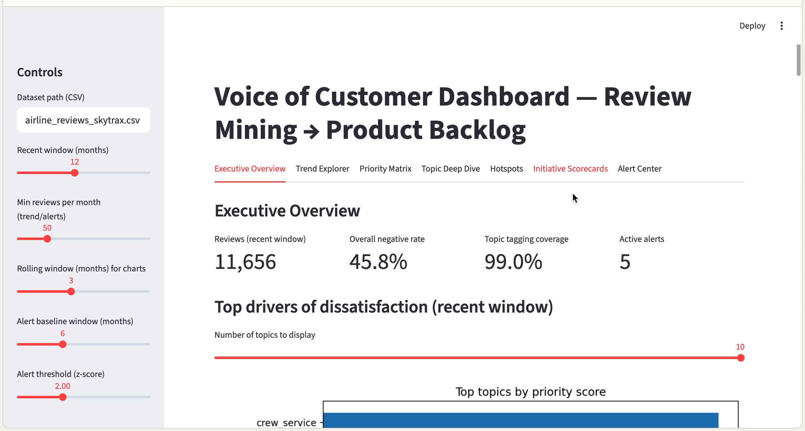

# Case Study 3 — Voice of Customer (VoC): Review Mining → Product Backlog

An end-to-end analytics workflow that converts unstructured airline reviews into **monthly issue trends** and a **prioritized improvement backlog** with measurable KPIs and tracking plans.

---

## Problem

Airline reviews contain rich operational and product signals (seat comfort, cabin crew, Wi‑Fi, boarding, IFE), but the information is unstructured and difficult to operationalize. This case study demonstrates a repeatable pipeline that translates free‑text feedback into decision-ready inputs for cross-functional teams.

---

## Data

- **Airline reviews (40k+ rows)** with review text and a 1–10 overall rating.
- The pipeline supports running on any similar review dataset as long as a text field and (optionally) a numeric rating are available.

**Local file:** `airline_reviews_skytrax.csv`

> Note: This repository is intended for portfolio/educational use. Data licensing and redistribution requirements should be validated for any production use.

---
## Dashboard demo (video)
Click the thumbnail to download the MP4!

---

## Approach

### 1) Weakly supervised sentiment labeling (rating → proxy label)
A 3-class proxy label is derived from the 1–10 rating:

- **pos**: rating ≥ 8  
- **neu**: rating 5–7  
- **neg**: rating ≤ 4  

Missing ratings remain unlabeled and are excluded from supervised training. Thresholds are configurable to align with business definitions.

**Observed coverage and balance (example run):**
- Labeled rows: **36,861 / 41,396 (~89%)**
- Class mix: **pos 45%**, **neg 34%**, **neu 21%**

### 2) Sentiment model (baseline, interpretable)
A lightweight classifier is trained on review text:

- **Text features:** TF‑IDF (unigrams + bigrams), `min_df=3`, `max_features=40k`
- **Model:** Multiclass Logistic Regression
- **Evaluation (example run):**
  - Accuracy: **0.759**
  - Macro F1: **0.683**
  - Neutral is the hardest class (typical under weak supervision)

The model produces per-review probabilities:
- `p_neg`, `p_neu`, `p_pos`
and a continuous score:
- `sentiment_score = p_pos − p_neg`

### 3) Interpretable topic tagging (aspect taxonomy)
Reviews are tagged via a deterministic keyword taxonomy (regex-based), covering topics such as:
- seat comfort, crew service, food & beverage, Wi‑Fi, boarding/gate, delay/punctuality, baggage, cleanliness, digital booking, entertainment/IFE

This is designed to be **stakeholder-friendly** and easy to iterate by inspecting matched examples and adding/removing keywords.

### 4) Optional topic discovery (NMF)
To surface additional themes not captured by the taxonomy:
- **NMF** topic modeling is run on a sample (up to 15k reviews)
- Helps validate coverage and discover emergent clusters

### 5) Trend and prioritization metrics
Monthly aggregation computes, for each topic:
- **Negative mention rate:** share of all reviews that (topic mentioned) AND (predicted negative)
- **Severity:** mean `p_neg` among reviews that mention the topic

For a recent window (e.g., last 12 months), a priority score is computed:

`priority_score = frequency_share_of_negative × severity_avg_p_neg`

Where:
- `frequency_share_of_negative` is the share of *negative* reviews mentioning the topic
- `severity_avg_p_neg` is average negative probability among those mentions

---

## Results snapshot (example run)

### Top topics in the recent window (last 12 months)
Ranked by `priority_score` (frequency × severity):

1. **entertainment** — 0.167 share of negative × 0.763 severity → **0.128**
2. **crew_service** — 0.125 × 0.792 → **0.099**
3. **seat_comfort** — 0.096 × 0.756 → **0.073**
4. **wifi** — 0.018 × 0.759 → **0.014**
5. **boarding_gate** — 0.009 × 0.704 → **0.006**

### Backlog translation (focus initiatives)
The highest-priority themes are translated into execution-ready initiatives with KPIs and tracking:

| Initiative | Primary topic | KPI examples | Tracking examples |
|---|---|---|---|
| Increase in-flight entertainment reliability and content freshness | entertainment | ↓ IFE negative mentions; ↑ IFE rating; ↑ usage | IFE health logs; content cadence; VoC trend by fleet |
| Service consistency program for cabin crew | crew_service | ↓ negative crew mentions; ↑ staff rating; ↑ compliment ratio | VoC by route/base; onboard survey; QA sampling |
| Reduce seat comfort pain points (legroom, cushioning, recline) | seat_comfort | ↑ comfort score; ↓ seat negatives; ↑ recommendation on affected fleets | Fleet/cabin segmentation; before/after; maintenance |
| Stabilize onboard Wi‑Fi reliability and speed | wifi | ↓ Wi‑Fi negatives; ↑ Wi‑Fi CSAT; ↑ satisfaction on equipped routes | Telemetry (uptime/throughput); VoC weekly; micro-survey |
| Improve boarding flow and gate communications | boarding_gate | ↓ boarding negatives; ↓ boarding variance; ↑ departure readiness | Gate timestamps; scan data; station drilldowns |

Full backlog template (10 initiatives): see the notebook section **“Translate insights to backlog”** or the exported CSV if present.

---

## Repository contents

- `CaseStudy3_VoC_ReviewMining_ProductBacklog_EN.ipynb`  
  Primary notebook with narrative + pipeline:
  - weak labels
  - sentiment model train/eval
  - probability scoring
  - topic tagging taxonomy
  - NMF discovery
  - monthly trends
  - priority matrix
  - backlog translation (KPIs + tracking plan)

- `airline_reviews_skytrax.csv`  
  Review dataset used in the case study.

---

## How to run

1. Create an environment (Python 3.10+ recommended).
2. Install dependencies:
   - `pandas`, `numpy`
   - `scikit-learn`
   - `matplotlib`
3. Open and run the notebook:
   - `CaseStudy3_VoC_ReviewMining_ProductBacklog_EN.ipynb`

> For reproducibility, keep `RANDOM_STATE` fixed and use stratified splits for sentiment training.

---

## Key design choices

- **Interpretable by default:** TF‑IDF + Logistic Regression and deterministic topic tagging make results easy to explain and debug.
- **Probability-based severity:** `p_neg` quantifies how strongly negative a topic mention is, which is more stable than hard labels alone.
- **Recent-window prioritization:** focusing on the most recent months supports actionable planning and avoids over-weighting legacy periods.

---

## Limitations

- **Weak labels add noise:** the rating reflects the overall journey while the text may focus on a single aspect.
- **Neutral is ambiguous:** mid-range ratings often contain mixed sentiment; neutral performance is typically lower.
- **Keyword taxonomy requires iteration:** synonyms and context can cause false positives/negatives; periodic sampling audits improve precision.

---

## Extensions (next steps)

- **Entity extraction and segmentation:** route, airport/station, aircraft type, cabin class, fare family.
- **Airline/fleet drilldowns:** compare theme severity and frequency by segment to identify hotspots.
- **Automated spike alerts:** anomaly detection on negative mention rate and severity.
- **Closed-loop measurement:** connect initiatives to operational telemetry and monitor pre/post deltas with guardrail metrics.

---

## Notes

This repository is structured as a portfolio artifact highlighting NLP, analytics, and cross-functional translation from VoC signals to an execution-ready backlog.
